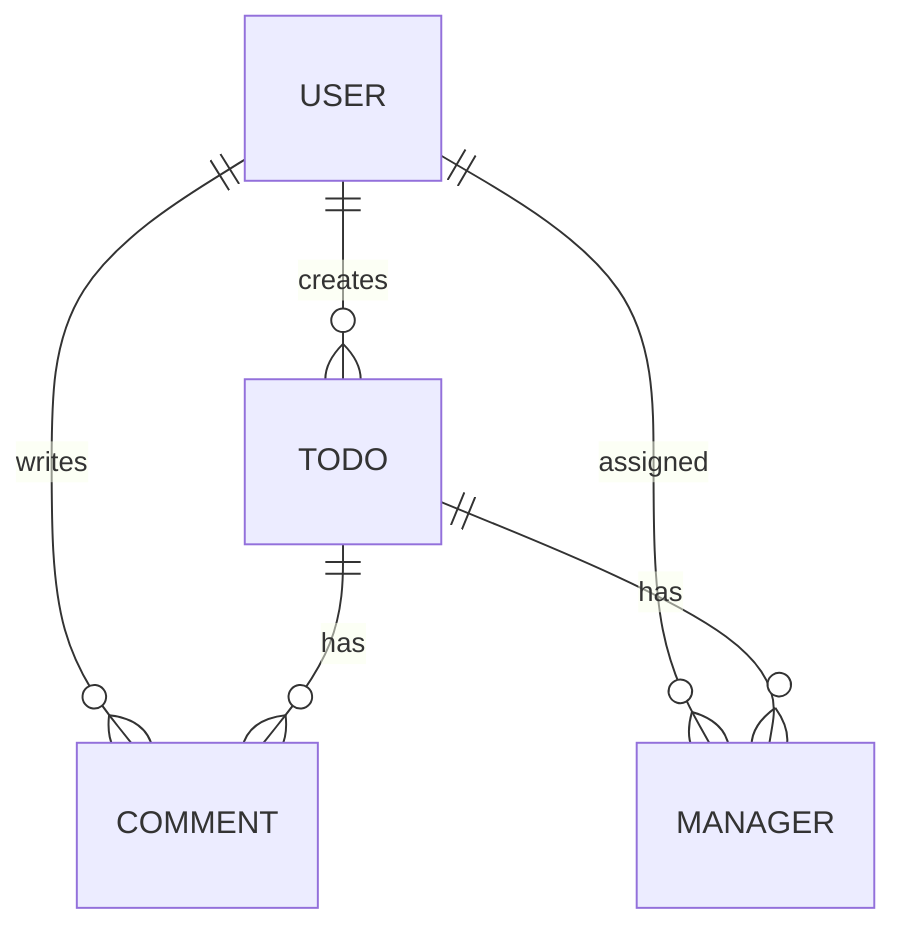

# Spring Advanced - Todo API Refactoring & Advanced Assignment

> `f-api/spring-advanced`를 fork하여  
> **JWT 인증/인가, 커스텀 ArgumentResolver, Validation, JPA 연관관계, N+1 개선, 테스트 리팩토링, AOP 로깅**까지 단계별로 반영한 Spring Boot 백엔드 과제 프로젝트입니다.

---

## 📌 프로젝트 개요

이 프로젝트는 단순 CRUD 구현보다 한 단계 더 들어가서,  
**"왜 이 코드가 이렇게 동작해야 하는가"**, **"어디서 검증하고 어디서 책임져야 하는가"**를 다루는 과제형 프로젝트입니다.

기반 도메인은 다음과 같습니다.

- 사용자(User)
- 할 일(Todo)
- 댓글(Comment)
- 담당자(Manager)

여기에 다음 개선 포인트를 단계별로 반영했습니다.

- 애플리케이션 실행 에러 분석 및 실행 환경 복구
- `@Auth AuthUser` 커스텀 파라미터 주입 구조 복구
- Early Return / 불필요한 `if-else` 제거
- 서비스 로직 검증을 DTO Validation으로 이동
- `@EntityGraph`를 활용한 N+1 문제 개선
- 잘못 작성된 테스트 코드 수정 및 예외 시나리오 보강
- Admin API 대상 AOP 기반 요청/응답 로깅 적용
- 직접 정의한 추가 개선 사항 문서화

---

## ✅ 구현 범위

| Level | 내용 | 반영 상태 |
|------|------|-----------|
| Lv0 | 실행 실패 원인 분석 및 애플리케이션 실행 가능 상태 복구 | ✅ |
| Lv1 | `AuthUserArgumentResolver` 정상 동작 복구 | ✅ |
| Lv2-1 | `signup()` Early Return 리팩토링 | ✅ |
| Lv2-2 | `WeatherClient` 분기 구조 단순화 | ✅ |
| Lv2-3 | 비밀번호 정책을 DTO Validation으로 이동 | ✅ |
| Lv3 | `TodoRepository` N+1 문제를 `@EntityGraph`로 개선 | ✅ |
| Lv4 | 오작성 테스트 수정 + 서비스 예외 처리 보강 | ✅ |
| Lv5 | Admin API AOP 로깅 적용 | ✅ |
| Lv6 | 직접 정의한 문제 해결 및 문서화 | ✅ |
| Lv7 | 테스트 커버리지 확인용 README 영역 구성 | ✅ (이미지 파일은 별도 추가 필요) |

---

## 🛠 기술 스택

### Backend
- Java 17
- Spring Boot 3.3.3
- Spring Web
- Spring Data JPA
- Spring Validation

### Database
- MySQL 8.x

### Authentication
- JWT
- Custom Filter
- Custom ArgumentResolver

### Test
- JUnit 5
- Mockito
- Spring Boot Test

### 기타
- Lombok
- BCrypt
- AOP
- Git / GitHub Fork 기반 과제 진행

---

## 🚀 실행 방법

## 1. 요구 사항

- Java 17
- MySQL 8.x
- IntelliJ 또는 Gradle 실행 환경

## 2. DB 생성

```sql
CREATE DATABASE expert;
```

## 3. 환경 설정

현재 프로젝트는 `application.yml` 기준으로 동작합니다.

예시:

```yaml
spring:
  datasource:
    url: jdbc:mysql://localhost:3306/expert
    username: root
    password: YOUR_PASSWORD
    driver-class-name: com.mysql.cj.jdbc.Driver

  jpa:
    show-sql: true
    hibernate:
      ddl-auto: create
    properties:
      hibernate:
        format_sql: true
    defer-datasource-initialization: true

logging:
  level:
    root: info

jwt:
  secret:
    key: YOUR_BASE64_SECRET_KEY
```

### 참고
- Lv0에서 실제 실행 실패 원인은 `application.yml` 및 `jwt.secret.key` 설정 누락이었습니다.
- `JwtUtil`은 `jwt.secret.key` 값을 기반으로 토큰을 생성/검증합니다.
- 토큰 만료 시간은 현재 코드 기준 **60분**입니다.

## 4. 실행

```bash
./gradlew bootRun
```

### 실행 시 참고
업로드된 압축본 기준으로는 `gradle-wrapper.properties`가 포함되어 있지 않아  
환경에 따라 `./gradlew` 실행이 되지 않을 수 있습니다.

이 경우 아래 중 하나로 실행하면 됩니다.

- IntelliJ에서 Gradle Sync 후 실행
- 로컬 Gradle 설치 후 `gradle bootRun`

## 5. 기본 인증 규칙

`/auth/**` 를 제외한 모든 API는 JWT 인증이 필요합니다.

```http
Authorization: Bearer {token}
```

또한 `/admin/**` 경로는 `ADMIN` 권한만 접근 가능합니다.

---

## 🔐 인증 / 인가 구조

### 인증 흐름

```mermaid
flowchart LR
    A[Client Request] --> B[JwtFilter]
    B -->|JWT 검증| C[Request Attribute 저장]
    C -->|userId, email, userRole| D[AuthUserArgumentResolver]
    D --> E[@Auth AuthUser]
    E --> F[Controller]
    F --> G[Service]
    G --> H[Repository]
```

### 핵심 포인트

- `JwtFilter`
  - `/auth` 제외 전 구간 JWT 검사
  - `Authorization` 헤더 검증
  - `userId`, `email`, `userRole`을 request attribute로 저장
- `AuthUserArgumentResolver`
  - `@Auth AuthUser` 파라미터를 자동 생성
  - 컨트롤러가 `HttpServletRequest`를 직접 파싱하지 않아도 됨
- `/admin/**`
  - `JwtFilter`에서 `ADMIN` 권한 여부를 추가 검사

---

## 🏗 프로젝트 구조

```text
src/main/java/org/example/expert
├── client
│   └── WeatherClient
├── config
│   ├── JwtFilter
│   ├── JwtUtil
│   ├── AuthUserArgumentResolver
│   ├── WebMvcConfig
│   ├── GlobalExceptionHandler
│   ├── FilterConfig
│   ├── PersistenceConfig
│   └── AdminLogCheckAspect
├── domain
│   ├── auth
│   ├── comment
│   ├── common
│   ├── manager
│   ├── todo
│   └── user
└── ExpertApplication
```

### 레이어 책임

| Layer | 역할 |
|------|------|
| Controller | 요청/응답 처리 |
| Service | 비즈니스 로직 |
| Repository | DB 접근 |
| Config | JWT, Filter, Resolver, AOP, 예외 처리 |
| DTO | 요청/응답 데이터 전달 |
| Entity | JPA 연관관계 및 도메인 상태 표현 |

---

## 🧩 JPA 연관관계



### 관계 요약

- `User` : `Todo` = 1:N
- `User` : `Comment` = 1:N
- `User` : `Manager` = 1:N
- `Todo` : `Comment` = 1:N
- `Todo` : `Manager` = 1:N

### 설계 포인트

- 대부분의 연관관계는 `LAZY` 로딩 기반입니다.
- `Todo` 생성 시 작성자를 기본 담당자로 함께 등록합니다.
- `Todo.comments`는 `CascadeType.REMOVE`
- `Todo.managers`는 `CascadeType.PERSIST`

---

## 📌 API 목록

<details>
<summary>👉 클릭해서 전체 API 보기</summary>

<br>

### AUTH

| Method | Endpoint | 설명 | 인증 |
|------|----------|------|------|
| POST | `/auth/signup` | 회원가입 | ❌ |
| POST | `/auth/signin` | 로그인 | ❌ |

### USER

| Method | Endpoint | 설명 | 인증 | 권한 |
|------|----------|------|------|------|
| GET | `/users/{userId}` | 사용자 단건 조회 | ✅ | USER / ADMIN |
| PUT | `/users` | 내 비밀번호 변경 | ✅ | USER / ADMIN |
| PATCH | `/admin/users/{userId}` | 사용자 권한 변경 | ✅ | ADMIN |

### TODO

| Method | Endpoint | 설명 | 인증 | 권한 |
|------|----------|------|------|------|
| POST | `/todos` | Todo 생성 | ✅ | USER / ADMIN |
| GET | `/todos` | Todo 목록 조회 | ✅ | USER / ADMIN |
| GET | `/todos/{todoId}` | Todo 상세 조회 | ✅ | USER / ADMIN |

### COMMENT

| Method | Endpoint | 설명 | 인증 | 권한 |
|------|----------|------|------|------|
| POST | `/todos/{todoId}/comments` | 댓글 등록 | ✅ | USER / ADMIN |
| GET | `/todos/{todoId}/comments` | 댓글 목록 조회 | ✅ | USER / ADMIN |
| DELETE | `/admin/comments/{commentId}` | 댓글 삭제 | ✅ | ADMIN |

### MANAGER

| Method | Endpoint | 설명 | 인증 | 권한 |
|------|----------|------|------|------|
| POST | `/todos/{todoId}/managers` | 담당자 지정 | ✅ | USER / ADMIN |
| GET | `/todos/{todoId}/managers` | 담당자 목록 조회 | ✅ | USER / ADMIN |
| DELETE | `/todos/{todoId}/managers/{managerId}` | 담당자 삭제 | ✅ | USER / ADMIN |

</details>

---

## ⚠ 예외 응답 구조

이 프로젝트는 성공 응답을 공통 래퍼로 감싸지 않고 DTO 자체를 반환합니다.  
대신 예외는 `GlobalExceptionHandler`에서 공통 형식으로 응답합니다.

예시:

```json
{
  "status": "BAD_REQUEST",
  "code": 400,
  "message": "Todo not found"
}
```

처리 대상 예외:

- `InvalidRequestException` → 400
- `AuthException` → 401
- `ServerException` → 500

---

## 🔎 핵심 구현 내용

## Lv0. 프로젝트 세팅 - 실행 실패 원인 해결

### 문제
애플리케이션 실행 시 `JwtUtil` 관련 설정 문제로 부팅에 실패했습니다.

### 해결
- `application.yml` 추가
- `jwt.secret.key` 설정 추가
- datasource / JPA 기본 설정 복구

### 의미
Spring Boot는 코드만 맞아도 되는 것이 아니라,  
**실행에 필요한 외부 설정까지 포함해야 정상 동작**합니다.

---

## Lv1. ArgumentResolver 복구

### 문제
`AuthUserArgumentResolver`는 존재하지만 실제 MVC에 등록되지 않아 동작하지 않는 상태였습니다.

### 해결
`WebMvcConfig`를 추가하고 `addArgumentResolvers()`에 직접 등록했습니다.

```java
@Configuration
public class WebMvcConfig implements WebMvcConfigurer {
    @Override
    public void addArgumentResolvers(List<HandlerMethodArgumentResolver> resolvers) {
        resolvers.add(new AuthUserArgumentResolver());
    }
}
```

### 의미
이 단계의 핵심은  
**"커스텀 리졸버는 구현만으로 끝나는 것이 아니라, MVC 확장 포인트에 등록되어야 한다"** 는 점입니다.

---

## Lv2. 코드 개선

### 1) Early Return

`AuthService.signup()`에서 이메일 중복 검사를 `passwordEncoder.encode()`보다 먼저 수행하도록 변경했습니다.

### 왜 중요한가?
이메일이 이미 존재하는 경우, 어차피 회원가입은 실패합니다.  
그런데도 먼저 `encode()`를 수행하면 불필요한 연산이 발생합니다.

즉,
- 검증 먼저
- 비용 큰 작업은 나중

이 순서가 더 맞습니다.

---

### 2) 불필요한 if-else 제거

`WeatherClient.getTodayWeather()`의 분기 구조를 단순화했습니다.

핵심은 다음입니다.

- 에러면 바로 예외
- 아니면 다음 로직 진행
- 불필요한 `else` 블록 제거

추가로 Lv6에서는 `RestTemplate` 기본 동작을 고려해  
상태 코드 분기보다 **실제 body 유무 검증 중심**으로 더 단순하게 정리했습니다.

---

### 3) Validation 책임 이동

기존에는 `UserService.changePassword()` 내부에서 새 비밀번호 형식을 직접 검사하고 있었습니다.

이를 다음 구조로 이동했습니다.

- DTO: `@Pattern`
- Controller: `@Valid`
- Service: 비즈니스 로직만 담당

적용 예시:

```java
@Pattern(
    regexp = "^(?=.*[A-Z])(?=.*\\d).{8,}$",
    message = "새 비밀번호는 8자 이상이어야 하고, 숫자와 대문자를 포함해야 합니다."
)
private String newPassword;
```

### 의미
이 구조가 중요한 이유는 책임 분리 때문입니다.

- DTO = 입력 형식 검증
- Service = 도메인 규칙 검증

즉, **형식 오류와 비즈니스 오류를 같은 계층에서 섞지 않도록 분리**했습니다.

---

## Lv3. N+1 문제 개선

`Todo` 목록 조회 시 `Todo.user` 연관 엔티티를 지연 로딩으로 하나씩 가져오면 N+1 문제가 발생할 수 있습니다.

기존 JPQL fetch join 방식 대신, 과제 요구사항에 맞게 `@EntityGraph`로 변경했습니다.

```java
@EntityGraph(attributePaths = {"user"})
Page<Todo> findAllByOrderByModifiedAtDesc(Pageable pageable);
```

### 의미
- JPA의 선언적 연관 로딩 제어 경험
- 쿼리 메서드 시그니처는 유지하면서 fetch 전략만 분리 가능
- 코드 가독성과 의도를 함께 확보

---

## Lv4. 테스트 코드 수정 및 예외 시나리오 보강

### 수정한 대표 항목

- `PasswordEncoderTest`
  - `matches()` 파라미터 순서를 올바르게 수정
- `ManagerServiceTest`
  - 실제 서비스 예외와 테스트 기대값을 일치시킴
  - 메서드명도 `NullPointerException`이 아니라 `InvalidRequestException` 맥락에 맞게 수정
- `CommentServiceTest`
  - 실제 서비스에서 던지는 예외 메시지와 테스트를 일치시킴
- `ManagerService.saveManager()`
  - `todo.getUser()`가 `null`인 경우를 방어하여 NPE 대신 의도한 예외를 반환하도록 수정

### 핵심 포인트
테스트는 단순히 "돌아가는 코드"를 확인하는 것이 아니라,
**현재 서비스 계약(contract)을 문서처럼 검증하는 역할**을 합니다.

---

## Lv5. Admin API 로깅

관리자 전용 API 접근 시 공통 로깅을 남기기 위해  
`*AdminController`를 대상으로 AOP를 적용했습니다.

대상 예시:

- `CommentAdminController.deleteComment()`
- `UserAdminController.changeUserRole()`

핵심 로깅 내용:

- 어떤 Admin API가 호출되었는지
- 요청 DTO를 JSON으로 어떻게 받았는지
- 응답 DTO가 무엇인지
- 예외 발생 시 어떤 메시지로 실패했는지

포인트컷:

```java
@Around("execution(* org.example.expert.domain..controller.*AdminController.*(..))")
```

### 의미
이 로직은 비즈니스 코드에 `log.info()`를 흩뿌리는 대신,  
**횡단 관심사를 한 곳에서 처리**한다는 점에서 구조적으로 더 깔끔합니다.

---

## Lv6. 직접 정의한 문제와 해결

### 문제 1. 회원가입 비밀번호 정책 불균형

비밀번호 변경 API는 강한 검증을 하는데,  
회원가입 API는 동일한 수준의 검증이 없었습니다.

### 해결
`SignupRequest.password`에도 동일한 정규식 기반 Validation을 추가했습니다.

### 기대 효과
- 회원가입과 비밀번호 변경 사이의 정책 일관성 확보
- 잘못된 비밀번호 형식을 더 앞단에서 차단
- 서비스 내부 로직 단순화

---

### 문제 2. WeatherClient 분기 중복

`RestTemplate` 기본 동작 특성상 실효성이 낮은 상태코드 분기보다,  
실제 비어 있는 응답 / 오늘 날짜 미존재 같은 실패 조건 검증이 더 중요하다고 판단했습니다.

### 해결
- 불필요한 분기 정리
- 날씨 데이터 body 검증 중심으로 단순화

### 회고
이 문제를 통해  
**"방어 코드가 많다고 무조건 좋은 것이 아니라, 실제로 의미 있는 검증인가"** 를 다시 보게 되었습니다.

---

## 🧪 테스트

### 테스트 전략

- Given - When - Then 패턴 유지
- 서비스 단위 테스트 중심
- 설정/필터/리졸버/AOP까지 테스트 범위 확장

### 확인 가능한 테스트 영역

- `AuthUserArgumentResolverTest`
- `PasswordEncoderTest`
- `WeatherClientTest`
- `ManagerServiceTest`
- `CommentServiceTest`
- `AdminLogCheckAspectTest`
- `JwtFilterTest`
- `GlobalExceptionHandlerTest`
- 기타 도메인/설정 테스트

### 저장소 기준 테스트 규모

- 테스트 파일: **45개**
- `@Test` 메서드: **126개**

> 위 수치는 업로드된 저장소의 테스트 코드 기준으로 정리했습니다.

---

## 📈 테스트 커버리지

과제 요구사항상 커버리지 이미지를 README에 첨부할 수 있도록 영역을 분리했습니다.

현재 업로드된 저장소에는 커버리지 이미지 파일이 포함되어 있지 않으므로,  
IntelliJ의 **Run with Coverage** 결과를 캡처한 뒤 아래 위치에 추가하면 됩니다.

```text
예시 경로
docs/images/coverage.png
```

```md
<!-- 예시 -->

```

---

## 🧠 학습 포인트

이 프로젝트에서 핵심적으로 다룬 기술 포인트는 다음과 같습니다.

- JWT 인증/인가 흐름
- Filter와 ArgumentResolver의 역할 차이
- DTO Validation과 Service Validation의 책임 분리
- JPA 연관관계와 LAZY 로딩
- `@EntityGraph`를 활용한 N+1 개선
- 테스트 코드와 실제 서비스 계약의 정합성
- AOP를 활용한 공통 로깅 처리
- 예외를 "터진 뒤 수정"이 아니라 "의도된 형태로 반환"하도록 설계하는 방식

---

## 🔥 트러블슈팅 요약

| 문제 | 원인 | 해결 |
|------|------|------|
| 애플리케이션 실행 실패 | `application.yml`, `jwt.secret.key` 누락 | 환경 설정 파일 추가 |
| `@Auth AuthUser` 동작 안 함 | Resolver 구현만 있고 MVC 등록 누락 | `WebMvcConfig`에서 등록 |
| 회원가입 시 불필요한 encode 수행 | 검증 순서 문제 | 중복 이메일 검사 선행 |
| 비밀번호 검증이 서비스에 박혀 있음 | 계층 책임 혼합 | DTO Validation으로 이동 |
| Todo 목록 조회 시 N+1 가능성 | 연관 엔티티 지연 로딩 | `@EntityGraph(attributePaths = {"user"})` 적용 |
| 테스트와 서비스 계약 불일치 | 예외 타입/메시지 불일치 | 테스트 수정 및 서비스 null 방어 추가 |
| Admin API 로깅 중복 가능성 | 컨트롤러마다 로깅 코드 추가 필요 | AOP로 공통 처리 |

---

## 🔗 링크

- 원본 과제 저장소: `f-api/spring-advanced`
- 내 과제 저장소: `https://github.com/puddingdream/spring-advanced`
- TIL / 트러블슈팅 기록: **별도 첨부 예정**

---

## ✅ 프로젝트 의의

이 프로젝트는 단순히 "기능이 된다"에서 끝나는 과제가 아니라,

- 왜 이 검증이 이 계층에 있어야 하는지
- 왜 이 테스트가 실패하는지
- 왜 N+1이 발생하는지
- 왜 공통 로깅은 AOP로 빼는지

를 코드로 한 번씩 마주보게 만든 과제였습니다.

즉, 이 README의 핵심은 기능 나열보다도  
**실행 - 검증 - 구조 - 테스트 - 개선**을 한 번의 프로젝트 안에서 경험했다는 데 있습니다.
